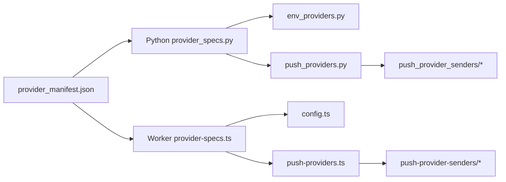

# 开发文档

这份文档面向后续维护者，说明仓库结构、核心边界、推送通道扩展方式、双端同步规则和发布前检查。首次部署和快速上手请看 [README.md](README.md)，完整用户文档见 `docs/deployment/` 和 `docs/reference/`，这里主要讲”怎么改代码不漂”。

## 目录

- [项目概览](#项目概览)
- [文档职责](#文档职责)
- [目录结构](#目录结构)
- [单一规范源](#单一规范源)
- [新增推送通道](#新增推送通道)
- [默认值和必填规则](#默认值和必填规则)
- [Python 运行时](#python-运行时)
- [Worker 运行时](#worker-运行时)
- [Web 控制台](#web-控制台)
- [调度器](#调度器)
- [测试和校验](#测试和校验)
- [发布检查清单](#发布检查清单)
- [常见维护坑](#常见维护坑)
- [推荐工作流](#推荐工作流)

## 项目概览

本项目有两套运行时，共用同一份业务语义：

- Python Docker 版：包含 Web 控制台、配置持久化、定时调度和推送执行。
- Cloudflare Workers 版：使用 TypeScript 实现无服务器定时触发和推送执行，并生成可粘贴的 `_worker.js`。

两端必须保持以下行为一致：

- 商品过滤和 Markdown 内容。
- 推送通道字段、默认值、环境变量名和 provider id。
- 推送结果摘要、脱敏规则和失败语义。
- `all`、`single`、`failover` 三种投递策略。



## 文档职责

- `README.md`：首次部署用户入口，只保留部署选择、最短上手路径、常见问题和文档导航。
- `docs/deployment/`：用户向部署手册，包含 Cloudflare Workers、GitHub Actions 等完整步骤、迁移和运维说明。
- `docs/reference/`：用户向参考资料，包含环境变量、推送通道、发送策略和 provider id 查表。
- `DEVELOPMENT.md`：维护者文档，描述代码边界、测试矩阵、双端同步规则和发布检查。

## 目录结构

关键文件如下：

```text
src/roco_serverchan_notifier/
  app.py                       Python 单次执行入口
  launcher.py                  Docker auto/web/scheduler 模式选择
  settings.py                  Python 设置模型和环境变量装配入口
  config.py                    Settings 兼容导出层
  config_store.py              控制台配置持久化
  provider_specs.py            读取并校验共享 provider manifest
  shared/provider_manifest.json 推送通道规格唯一来源
  env_providers.py             从环境变量构造 ProviderConfig
  push.py                      Python 推送兼容导出入口
  push_delivery.py             all/single/failover 投递策略
  push_providers.py            provider 校验、分发和脱敏门面
  push_provider_senders/       一 provider 一模块的发送器
  push_http.py                 通用 HTTP 结果解析
  push_provider_auth.py        企业微信 token、钉钉/飞书签名
  push_models.py               推送数据模型
  push_redaction.py            推送错误脱敏
  rocom.py                     远行商人 API 调用
  merchant_message.py          商品摘要与 Markdown 消息构建
  goods_catalog.py             商品目录
  time_utils.py                北京时间与轮次计算
  web.py                       FastAPI 控制台入口
  web_services.py              控制台 API 服务层
  web_auth.py                  兼容导出层
  console_password.py          控制台密码策略和首次随机密码
  console_session.py           session cookie 签名与验证
  scheduler.py                 调度运行循环和手动触发
  schedule_policy.py           定时时间解析和下一次运行计算
  scheduler_state.py           调度状态模型
  healthcheck.py               Docker 健康检查

cloudflare-worker/
  src/index.ts                 Worker HTTP/Cron 入口
  src/config.ts                Worker 环境变量装配
  src/types.ts                 Env 类型定义
  src/provider-specs.ts        读取并校验共享 provider manifest
  src/push.ts                  Worker 推送兼容导出入口
  src/push-delivery.ts         all/single/failover 投递策略
  src/push-providers.ts        provider 校验、分发和脱敏门面
  src/push-provider-senders/   Worker provider 发送器
  src/push-provider-auth.ts    企业微信 token、钉钉/飞书签名
  src/push-http.ts             通用 HTTP 结果解析
  src/push-redaction.ts        推送错误脱敏
  src/rocom.ts                 数据入口
  src/rocom-client.ts          数据源 API 调用
  src/rocom-processing.ts      商品过滤与处理
  src/rocom-message.ts         Markdown 消息构建
  src/rocom-time.ts            北京时间与轮次计算
  _worker.js                   生成产物，不要手写

docs/
  deployment/cloudflare-workers.md Cloudflare Workers 完整部署说明
  deployment/github-actions.md     GitHub Actions 定时推送说明
  reference/environment-variables.md 环境变量全量参考
  reference/providers-and-delivery.md 推送通道、发送策略和 provider id 参考
```

## 单一规范源

`src/roco_serverchan_notifier/shared/provider_manifest.json` 是推送通道元数据的唯一来源。它包含：

- `type`：provider 类型，必须和发送器注册表 key 一致。
- `label`、`description`：控制台展示文案。
- `envId`：环境变量模式下自动生成的 provider id。
- `envVars`：provider 配置字段到环境变量名的映射。
- `fields`：控制台字段、必填规则、是否敏感、默认值。

不要在 Python、Worker 或前端里再手写同一份 provider id、env var 映射或默认值。需要读取时使用：

- Python：`provider_env_id()`、`provider_env_fields()`、`provider_field_default()`、`provider_env_binding_names()`。
- Worker：`providerEnvId()`、`providerEnvFields()`、`providerFieldDefault()`、`providerEnvBindingNames()`。
- 控制台：`/api/provider-types` 只返回 `label`、`description`、`fields`，内部 `envId/envVars/type` 不暴露给前端。

manifest 加载时两端都会做运行时校验。新增字段时要同步更新 Python 和 Worker 的校验器，避免某端静默接受错误形状。

## 新增推送通道

推荐按下面顺序做，顺序很重要，小船别一边刷漆一边下水。

1. 在 `provider_manifest.json` 增加 provider。
2. 确认 `type` 唯一，`envVars` 的每个 key 都能在 `fields.name` 中找到。
3. 在 Python 的 `push_provider_senders/` 添加或扩展发送器。
4. 在 `push_provider_senders/registry.py` 注册 `type -> sender`。
5. 在 Worker 的 `push-provider-senders/` 添加或扩展发送器。
6. 在 `push-provider-senders/registry.ts` 注册 `type -> sender`。
7. 如果需要通用鉴权、签名或响应解析，优先放入 `push_provider_auth.py` / `push-provider-auth.ts` 或 HTTP helper，避免散落到各 sender。
8. 补 Python 单元测试，至少覆盖 payload、成功判断、失败脱敏和 registry 覆盖。
9. 补 Worker 单元测试，至少覆盖 payload、成功判断、失败脱敏和 registry 覆盖。
10. 如果 Python/Worker 行为必须一致，更新 `tests/fixtures/cross_runtime_cases.json` 和 `cloudflare-worker/tests/cross-runtime.test.ts`。
11. 运行完整检查并重新生成 `_worker.js`。

新增 provider 的最小测试要求：

- `set(PROVIDER_SENDERS) == set(PROVIDER_TYPES)` 继续通过。
- Worker `Object.keys(PROVIDER_SENDERS)` 和 `Object.keys(PROVIDER_TYPES)` 继续一致。
- `provider_manifest` 校验能覆盖字段缺失、重复 type、envVars 未声明字段。
- secret 出现在错误消息、URL 或响应体时会被脱敏。

## 默认值和必填规则

默认值属于 manifest，不属于 sender。

- 环境变量装配时，空 env 会回退到字段 `default`。
- 控制台新增 provider 时，字段 `default` 会进入初始 config。
- 发送器直接收到旧配置或测试配置时，应通过 `provider_config_text()` / `providerConfigText()` 回退 manifest default。
- `send_provider` / `sendProvider` 做必填校验时，也会接受 manifest default。

如果某个 provider 支持“二选一”配置，比如企业微信群机器人 `webhook` 或 `key`，优先用通用规则表达：两个字段都不是 required，只要任一环境变量显式配置就启用 provider。只有通用规则表达不了时，才新增 manifest 能力，不要在 Python/Worker 各写一份特殊分支。

## Python 运行时

Python 版有四层边界：

- 配置层：`settings.py`、`env_providers.py`、`config_store.py`。
- 执行层：`app.py` 拉取数据、处理消息、调用投递。
- 推送层：`push_delivery.py` 管策略，`push_providers.py` 管校验和分发，sender 只管某个通道的 HTTP 调用。
- 控制台层：`web.py` 管路由，`web_services.py` 管 API 业务，`console_password.py` 和 `console_session.py` 管认证细节。

保持这些边界：

- sender 不读取环境变量，不保存配置，不知道投递策略。
- `push_delivery.py` 不关心具体通道协议。
- `web.py` 尽量薄，复杂逻辑放 `web_services.py` 或认证模块。
- `scheduler.py` 只保留运行循环和任务触发，时间策略放 `schedule_policy.py`，状态展示放 `scheduler_state.py`。

## Worker 运行时

Worker 版的源码在 `cloudflare-worker/src/`，`cloudflare-worker/_worker.js` 是生成产物。

开发约束：

- 不直接编辑 `_worker.js`。
- 改 Worker 源码后必须运行 `npm run build:worker`。
- 提交前运行 `npm run check:worker`，它会重新构建并检查 `_worker.js` 是否同步。
- `Env` 类型只手写非 provider 核心绑定。provider env binding 由 manifest 派生，不要把 `SERVERCHAN_SENDKEY` 这类清单加回 `types.ts`。

Worker 本地调试：

```bash
cd cloudflare-worker
npm ci
cp .dev.vars.example .dev.vars
npm run dev
```

访问：

- `http://localhost:8787/health`
- `http://localhost:8787/trigger`
- 配置 `TRIGGER_TOKEN` 后，使用 `?token=...`、`X-Trigger-Token` 或 `Authorization: Bearer ...`。

## Web 控制台

控制台静态资源位于 `src/roco_serverchan_notifier/static/`，模板位于 `templates/`。

认证边界：

- `web_auth.py` 是兼容导出层，尽量不要继续加业务逻辑。
- 密码生成、哈希、缓存、日志提示在 `console_password.py`。
- cookie 生成、签名、过期验证在 `console_session.py`。
- 保存配置后要调用 `reset_console_auth_cache()`，避免缓存旧认证信息。

provider 字段展示来自 `/api/provider-types`。这个 API 故意只暴露公开字段，不能把 `envId`、`envVars` 等内部部署元数据传给前端。

## 调度器

调度器拆成三块：

- `schedule_policy.py`：纯函数，解析 `SCHEDULE_TIMES` 和计算下一次执行时间。
- `scheduler_state.py`：状态数据结构和 `to_dict()`。
- `scheduler.py`：异步循环、wake、run-now、互斥执行和 CLI。

新增调度策略时优先扩展 `schedule_policy.py`，并保持可单测。只有涉及任务生命周期、锁、wake event 的逻辑才放回 `SchedulerService`。

## 测试和校验

提交前至少运行：

```bash
# Python
uv run python -m unittest discover -s tests
uv run python -m compileall -q src main.py tests
docker compose config --quiet

# Worker
cd cloudflare-worker
npm test
npx tsc --noEmit
npm run check:worker
```

Windows 本地如果 `uv run` 因可执行文件锁失败，可以使用项目虚拟环境：

```powershell
.\.venv\Scripts\python.exe -m unittest discover -s tests
.\.venv\Scripts\python.exe -m compileall -q src main.py tests
```

测试分层：

- `tests/test_config.py`：Python 配置和环境变量装配。
- `tests/test_config_store.py`：控制台配置持久化。
- `tests/test_settings.py`：设置模型和环境变量装配。
- `tests/test_push_delivery.py`：Python sender、投递策略、脱敏和 registry。
- `tests/test_push_http.py`：通用 HTTP 结果解析。
- `tests/test_push_provider_auth.py`：企业微信 token、钉钉/飞书签名。
- `tests/test_merchant_message.py`：商品摘要与消息构建。
- `tests/test_web_auth.py`：控制台认证、密码持久化和 session。
- `tests/test_web_services.py`：控制台 API 服务层。
- `tests/test_scheduler.py`：时间策略、状态和运行循环。
- `tests/test_rocom.py`：数据处理、消息构建和共享 fixture。
- `tests/test_cf_worker_deploy_script.py`：CF Worker 部署脚本检查。
- `tests/test_github_actions_workflows.py`：GitHub Actions 工作流检查。
- `cloudflare-worker/tests/worker.test.ts`：Worker 入口、配置、触发鉴权和端到端流程。
- `cloudflare-worker/tests/push-modules.test.ts`：Worker 推送模块边界、sender、HTTP 和脱敏。
- `cloudflare-worker/tests/rocom-modules.test.ts`：Worker 的时间、数据处理、消息构建模块边界。
- `cloudflare-worker/tests/cross-runtime.test.ts`：Python/Worker 共享行为 fixture。

## 发布检查清单

每次合并前确认：

- 没有手写修改 `_worker.js`，它来自 `npm run build:worker`。
- 新 provider 已进入 manifest、Python registry、Worker registry。
- 新 provider 的 secret 字段在 manifest 中标记 `secret: true`。
- Python 和 Worker 测试都覆盖了新增行为。
- README 面向首次部署用户；`docs/deployment/` 面向部署细节；`docs/reference/` 面向配置查表；架构、扩展流程或内部边界改动要同步 DEVELOPMENT。
- `git diff --check` 无空白错误。CRLF 提示在 Windows 工作区可能出现，不等于 diff 错误。

## 常见维护坑

- 不要复制 env var 表到 `types.ts`。provider env 来自 manifest。
- 不要在 sender 里硬编码 manifest 已经有的默认值。
- 不要让 public provider API 泄漏 `envId/envVars`。
- 不要把控制台空 secret 保存成覆盖旧 secret，`parse_providers(... keep_blank_secrets=True)` 负责保留旧值。
- 不要在 `run_now()` 绕过 `_run_lock`，否则手动触发和定时触发可能并发。
- 不要把 token、webhook、access_token 原文写入异常消息或测试断言输出。

当前 sender 模块约定：

- 一个 provider 一个模块，例如 `serverchan.py`、`telegram.py`、`wecom_bot.py`。
- `registry.py` 只负责汇总 `type -> send_*` 映射，不承载具体协议逻辑。
- 共享工具继续放在 `common.py`，仅保留跨 provider 的纯辅助函数。

## 推荐工作流

1. 先改共享规范或模块边界。
2. 写 Python 测试。
3. 写 Worker 测试。
4. 跑 Python 测试和编译。
5. 跑 Worker 测试和类型检查。
6. 运行 `npm run build:worker` 或 `npm run check:worker`。
7. 更新 README 或 DEVELOPMENT。
8. 最后跑 `git diff --check`，看一遍 diff。
